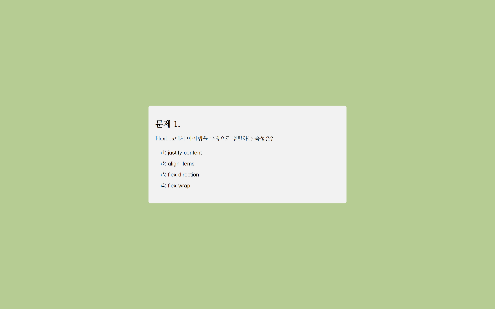
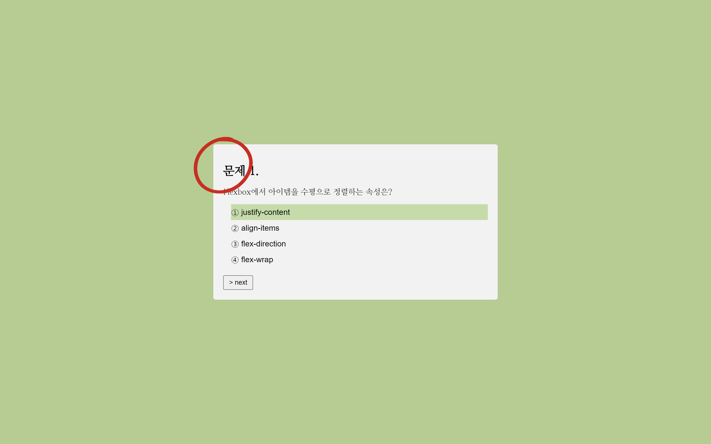
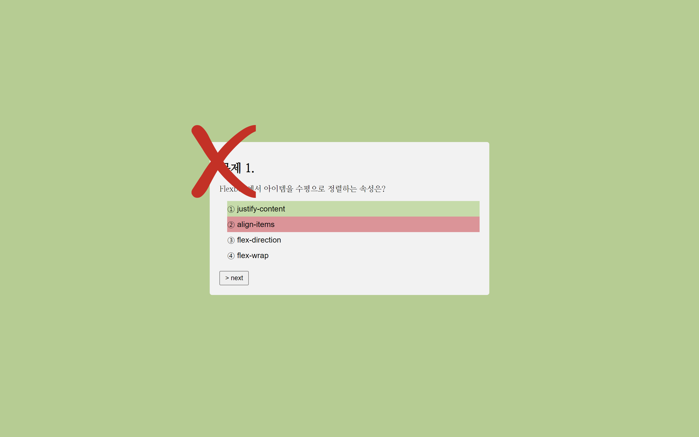

# 미션 3 퀴즈 앱

## 목표 
https://drive.google.com/file/d/1iDUcGAkxgP5lrroJbC365viLZokHKhk8/view

## 미리보기

메인


정답 선택시


오답 선택시 


플레이

## 들어가며 
이번 미션은 목표 영상을 봐도 도무지 뭘 만들어야하는 건지 알 수 없었다...<br/>
내가 이해한 구현해야하는 기능은 다음과 같다.

**구현 내용**
1. 문제 데이터를 html에 바인딩
2. 고룬 선택지에 따라 화면을 분기
    1. 정답인 경우
    2. 오답인 경우
3. 1, 2 과정 반복

이전 미션에 비해 굉장히 쉽다. 그래서 기능 구현보다 다른 곳에 주안점을 두고 개발을 했다.

## 구현 사항

1. 데이터 가공 (data 디렉토리)

    >originalData.txt (from ChatGPT) <br/>
    --(data.js)--> <br/>
    parsedData.js

    프론트 엔드 퀴즈를 내면 좋겠다 싶어서 chatGPT에게 문제를 요구봤다. 그러자 문제 데이터를 txt로 주길래 연습할 겸 fs로 데이터를 갖고와서 데이터를 파싱하는 함수를 작성했다.(data.js) 
    
    함수를 작성하던 중 문득 'json형식으로 퀴즈 데이터 만들어줘' 라고 질문하면 되지 않을까 싶어서 해보니 정말 됐다....그러나 연습이니 변수명만 참고하고 직접 해보았다.

<br/>

2. 관심사별 함수분리

    >정오답을 판단하는 함수 (grading),<br/>
    다음 문제로 넘어가는 함수 (toNextQuestion), <br/>
    다음 문제의 데이터를 바인딩하는 함수 (renderQuiz) 로 각자 역할에 맞게 쪼갰다.

<br/>

3. 문제 위에 정오답 표시 (O, X)

    >::after 선택자를 이용해서 문제 번호 위에 O, X를 표시 했다.

    정답과 오답은 after의 이미지 경로만 바뀌므로 js로 그 부분만 바꾸려고 했으나 찾아보니 여러가지로 번거러운 게 많아서, 두 가지 class correct와 incorrct에 대해 각각 ::afterf를 만들고 class만 제어하기로 했다.
    >

## 트러블 슈팅
1. 문제 데이터에 iframe 테그가 있었다. innerHTML로 데이터를 바인딩했더니 iflame이 텍스트가 아닌 HTML로 평가되어 들어가 버렸다. (6번 문항) 
    - textContent로 바인딩하니 제대로 문자로 출력됐다.

## 배운 점
1. next 버튼을 만들기 전, 문제 답을 선택하면 바로 다음 문제로 넘어가게 되어있었다. 이 때 계속 클릭을 하면 다음 문제로 넘어감과 동시에 텍스트가 하이라이트가 되는 문제가 있었다. 그래서 하이라이트가 되지 않도록 하는 속성을 찾아봤는데 user-select라는 속성이 있음을 알게 됐다. 
```css 
user-select none
```
이 속성을 추가하면 하이라이트를 못 한다.
