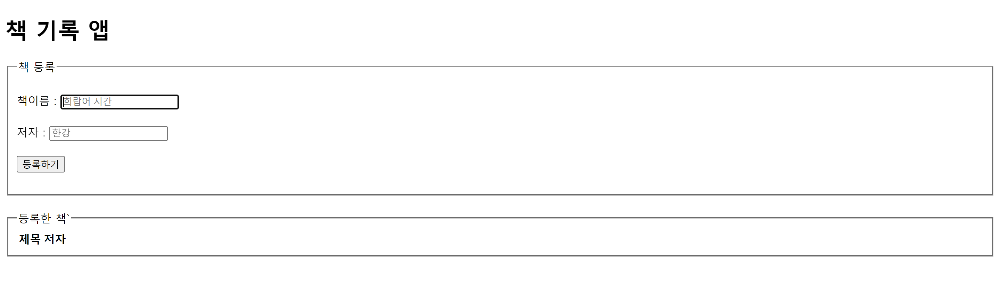
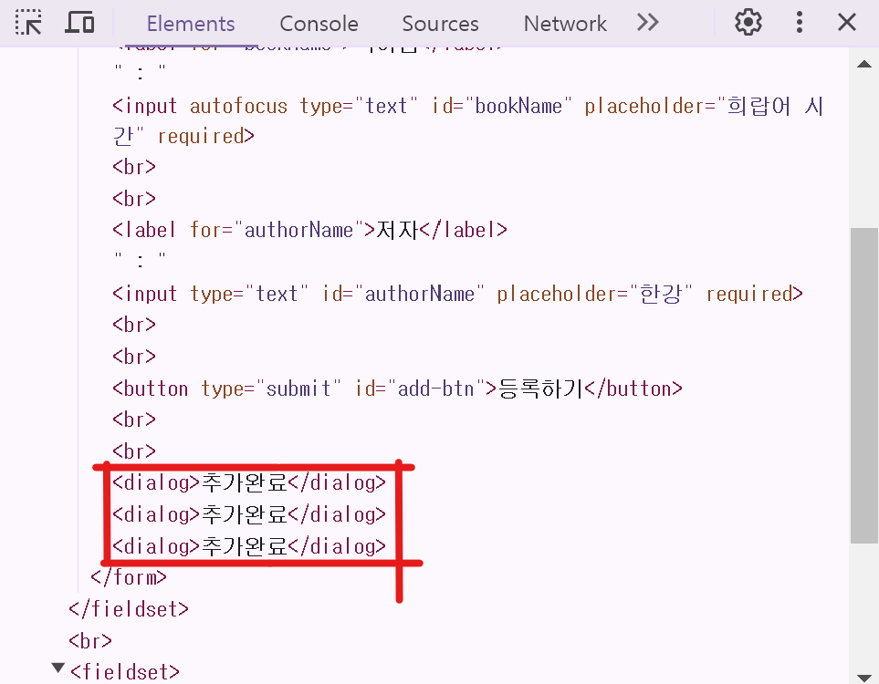

# 미션 4 리스트 앱

## 목표 
https://drive.google.com/file/d/1xsH6RU_0EPrTFS9BfCfx1Q3e5H2Z3ELL/view

## 미리보기

진입화면


책 등록 후 화면


시연

## 들어가며
리액트에서 지겹도록 한 todo앱이다. MVC패턴을 생각하며 구현해보려 노력했다. 

이번 서브미션은 **No-CSS**이며, 낯선 HTML 테그들을 활용해보았다.
(dialog, fieldset, legend, table)

## 구현 사항
- 리스트 추가 및 삭제
    1. 데이터 수정 (MODEL)
        - 데이터 추가 : bookData 배열에 데이터를 추가한다.
        - 데이터 삭제 : bookData 배열에서 데이터를 삭제한다.
    3. 랜더링 (CONTROL) : 수정된 데이터를 받아와서 template(VIEW)에 데이터를 바인딩하여 랜더링
    3. 알림 : 데이터 수정 후 성공 알림을 띄움 (dialog)
- 입력 편의 개선
    
    1. 페이지 최초 진입시 제목 input에 autofocus되도록 속성을 추가함
    1. 책을 등록 후 제목 input을 비우고, 제목 input에 focus가 되도록 함

## 트러블 슈팅
- dialog를 띄우는 과정에서 아래와 같이 dialog 테그를 동적으로 추가하여 사용하니 DOM에 dialog테그가 쌓이는 문제가 발생했다.
```js
function showDialog(label, element = form) {
  const dialog = document.createElement("dialog");
  dialog.innerHTML = label;
  element.append(dialog);
  dialog.open = true;
  setTimeout(()=> {
    dialog.open = false
  }, 1000)
}
```


사실 크게 문제는 없지만 쌓이면 성능저하 될 수도 있으니 고쳐봤다.

해결책은 간단하다. setTimeout 내부에서 dialog를 지우면 된다.
```js
function showDialog(label, element = form) {
  const dialog = document.createElement("dialog");
  dialog.innerHTML = label;
  element.append(dialog);
  dialog.open = true;
  setTimeout(()=> {
    --------------------------------
    dialog.remove()
    --------------------------------
  }, 1000)
}
```