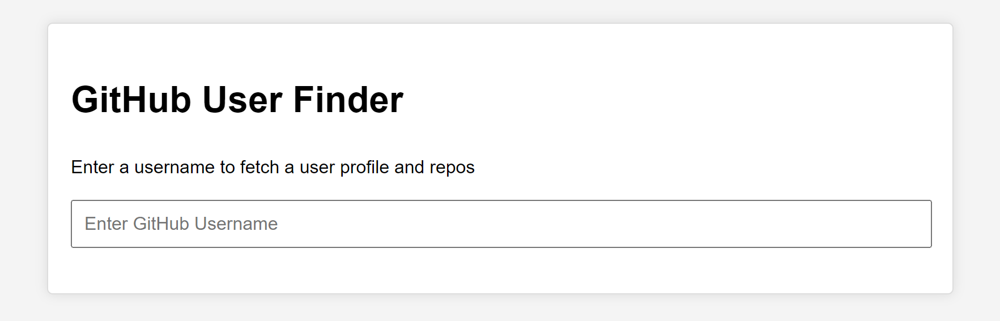
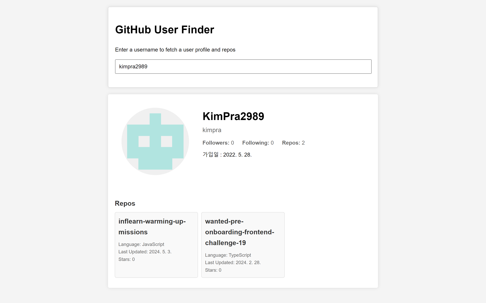
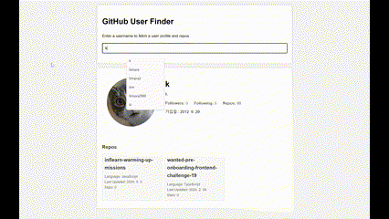

# 미션 5 GitHub Finder 앱

## 목표 
https://drive.google.com/file/d/1iTxhfrL0AZ1p560K2gaHlEn_1gz7ZFZF/view

## 미리보기

검색창

검색후

시연

## 구현 사항
- GitHub api에 요청해 데이터를 페칭하여 바인딩함.

    1. 검색창 input에 change 이벤트리스너를 부착한다.
    2. input의 값이 바뀔 때마다 fetch 함수를 통해 데이터를 불러온다.
    3. 데이터가 없는 경우 (response.message == 'Not Found') 에는 유저 데이터를 표시하지 않는다.
    4. repo가 존재한다면, repo 데이터를 fetch하여 유저정보 하단에 repo정보를 그린다.

- repo를 star gazer 수에 따라 내림차순 정렬하여 보여줌.
    1. sort메소드를 이용하여 정렬 후 데이터를 넘겨줌