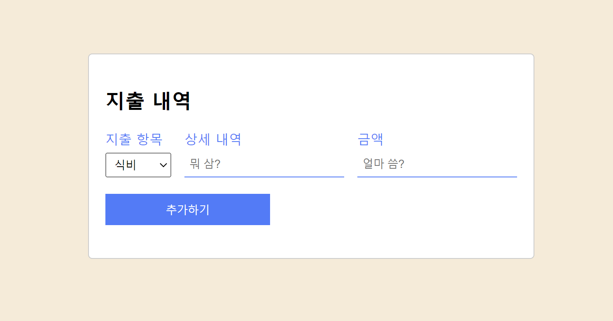
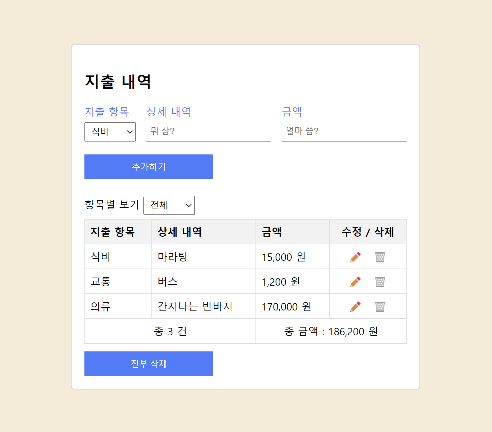
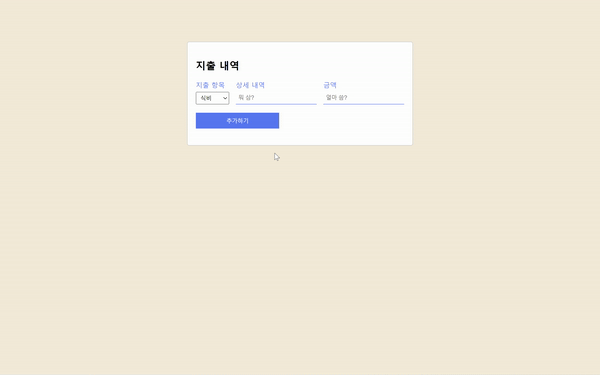

# 미션 1 예산 계산기 앱 (지출 내역)

## 목표

https://drive.google.com/file/d/1jAYF8HK6bJgkTOdwd-gTbkWRJWrUIbAf/view

## 미리보기


초기화면


항목 추가 후


수정 / 삭제 완료 팝업 알림



시연

## 개괄
- 스펙

    React, Vite, yarn,
    
    lib) React-toastify

- 설명

    CRUD 기능이 되는 지출 내역 관리 앱입니다.

- 프로젝트 목표

    1. styled-component나 emotion 같은 css-in-JS 기능을 라이브러리 없이 구현.
    2. Button, Input 등의 기본 컴포넌트들을 만들고 조합하여 확장 가능한 구조 설계.

## 상세
### 폴더 구조
```
src
│  App.css
│  App.jsx
│  main.jsx
│
├─components
│  ├─Input
│  │      InputContainer.jsx
│  │      InputField.jsx
│  │
│  ├─Result
│  │      Filter.jsx
│  │      ResultField.jsx
│  │      ResultRow.jsx
│  │      ResultTable.jsx
│  │
│  └─shared
│          Button.jsx
│          Flex.jsx
│          Input.jsx
│          Select.jsx
│          Spacing.jsx
│
└─constant
        category.js
        colors.js
```


하단의 사진처럼 앱은 크게 상단의 InputField와 ResultField로 구성된다. 이에 따라, 컴포넌트 하위 구조를 크게 input과 result로 나누어 응집도를 높였다. 


### 목표 수행 결과

props로 color를 받아 label과 border-bottom 색상을 설정할 수 있도록 했다. 또, controlled 방식으로 input을 사용하기 위해 state와 그 setter함수 역시 props로 받을 수 있도록 설계했다.
```jsx
// input.jsx

function Input({ label, type, placeholder, color, state, setState }) {
  const containerStyle = {
    display: 'flex',
    flexDirection: 'column',
    width: '100%',
  }
  const labelStyle = {
    color,
  }
  const inputStyle = {
    borderWidth: '0 0 1px',
    borderColor: color,
    outline: 'none',
    padding: '6px',
    marginTop: '6px',
    height: '30px',
    boxSizing: 'border-box',
  }

  return (
    <div style={containerStyle}>
      <label style={labelStyle}>{label}</label>
      <input
        id="category"
        type={type}
        placeholder={placeholder}
        style={inputStyle}
        value={state}
        onChange={(e) => {
          setState(e.target.value)
        }}
      ></input>
    </div>
  )
}
```

Button 컴포넌트의 경우, :hover를 js로 css로 추가할 방법을 찾을 수 없어서 이벤트 리스너를 부착하여 해결했다.  CSS-in-JS 라이브러리에서 SCSS 방식의 &:hover가 참 편한 기능이라는 걸 새삼 다시 느꼈다.
```jsx
// Button.jsx (일부)
function Button() {
  const [isHovered, setIsHovered] = useState(false)

  const handleMouseEnter = () => {
    setIsHovered(true)
  }

  const handleMouseLeave = () => {
    setIsHovered(false)
  }

  return (
    <button
      onMouseEnter={handleMouseEnter}
      onMouseLeave={handleMouseLeave}
    >
    </button>
  )
}
```

### 기능 상세

1. inputField에 항목, 내역, 금액을 입력하면, 하단 resultField 표에 데이터가 추가된다.
    - App 컴포넌트에서 관리하는 state를 input에서 set한 결과를 토대로 resultField에 랜더링한다.

2. 표에 추가된 데이터를 토대로 테이블 footer에 총 데이터 건수, 총 금액을 계산하여 표시한다. 이때, 항목별 보기 select에서 옵션을 선택하면 **항목에 맞는 데이터만의 subTotal를 보여준다.** 또, 금액 데이터는 ,로 구분된 숫자로 랜더링한다.
    - 원본 데이터 state는 ResultField 컴포넌트에서 관리하며 subtotal을 위한 filter된 데이터를 함수로 처리한 후 props로 하위 컴포넌트로 넘겨 랜더링했다. 숫자 데이터는 toLocaleString 메소드를 이용해 랜더링했다. 

    ```jsx
    // ResultField.jsx

    const filtered = useCallback(
        (arr) => {
            return arr.filter((item) => {
            if (filter == '전체') {
                return true
            }
            return item.category == filter
        })
    }, [filter])

    <ResultTable filteredResult={filtered(result)} />
    ```

3. 삭제 버튼을 누르면 삭제를 수행하고, 수정 버튼을 누르면 기존 inputFiled의 추가하기 버튼은 수정하기로 바뀌고, input은 수정하기를 누른 데이터를 value로 변경한다. 수정이 완료되면, 수정한 행의 데이터를 바꾸어 랜더링한다.
    
    ```js
    // 삭제
    const deleteHandler = (idx) => {
        setResult((prev) => {
          prev.splice(idx, 1)
          return prev.slice()
        })
        toast.success('🗑️ 삭제 완료 🗑️');
    }

    // 수정
    const updateHandler = (idx) => {
        setUpdate(true)
        setUpdateIdx(idx)
        setCategory(category)
        setDetail(detail)
        setCost(cost)
    }
  
  ## 회고
  CSS-in-JS를 만들어 보면서 그 원리를 조금이나마 이해해볼 수 있었다. 또, 병렬로 놓인 컴포넌트(input과 result)상에서 props 전송을 위해 루트 컴포넌트에서 props를 모두 관리하니 전송해야하는 props양이 많고, 이에 따른 props drilling의 문제점이 무엇인지 알 수 있었다. 
  
  그리고 왜 만드는지 의문이던 constants 폴더와 파일에 대해서도 base component를 만들면서 이해 할 수 있게 됐다. constant 상의 데이터만 바꾸면 컴포넌트에서 랜더링된 정보 역시 손 쉽게 바꿀 수 있어, 유지보수가 수월해서이다.

  import 뒤에 오는 ;이 지저분해보여서 prettier의 도움을 받기 위해 .prettierrx 파일을 만들고, package.json script에 format을 등록하여 사용해보았다. script를 직접 작성하는 건 처음이라 잘 안 되면 어쩌나 걱정했는데 잘 실행이 되서 다행이다.

```json
    //package.json script

    "format": "prettier --write \"src/**/*.jsx\""
```
데이터의 구조화를 위해 ResultField를 table 테그를 이용해서 작성을 했는데, react에선 thead나 tbody등의 큰 테그들로 tr를 묶지 않으면 경고를 준다. 사실 flex나 grid등을 많이 써서 table은 오랜만에 써봤는데 구조를 다시 리마인드해볼 수 있는 계기가 된 것 같다.

사실 기본 기능은 매우 간단했지만 필터를 추가하고, css in js를 구현하고...혼자 만든 서브미션을 클리어하느라 굉장히 오랜 시간을 쓴 것 같다. 다음은 좀 수월하게 가보자