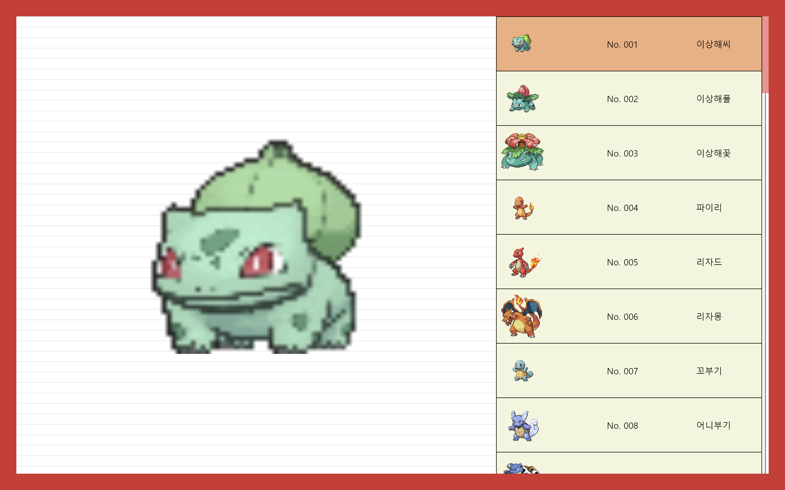
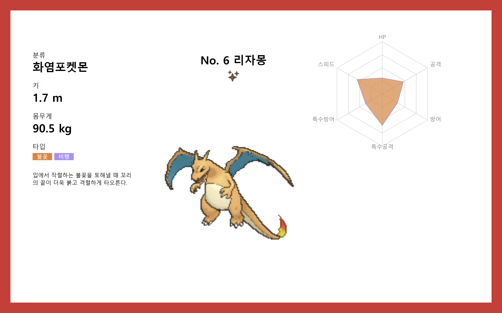

# 미션 3 포켓몬 도감 앱

## 목표

https://drive.google.com/file/d/18L1GZtyHo6m6UJEYmFSkofupSNqbHQav/view

## 미리보기


초기화면


상세페이지


시연

## 개괄

- 스펙

  - React, Vite, ts
  - React-query
  - Emotion
  - Recharts

- 설명

  인게임 포켓몬 도감을 모티브로 구현을 해봤습니다.

- 프로젝트 주목표

  1. API를 분석하여 자원을 효율적으로 분배
  2. react-query의 useInfiniteQuery를 활용한 무한 스크롤 구현
  3. rechart 차트라이브러리를 활용한 데이터 시각화
  4. Emotion을 활용해 공통 컴포넌트를 스타일드 컴포넌트로 구현하여 활용성을 높임
  5. forwardRef를 활용해 부모요소에서 자식 요소의 스크롤 이벤트를 관리

## 상세

### 폴더 구조

```
<!--  명령어 : tree /f -->
src
│  App.tsx
│  Fetcher.ts
│  globalStyles.ts
│  interface.ts
│  main.tsx
│  vite-env.d.ts
│
├─assets
│      pokeball.png
│      react.svg
│
├─components
│  ├─Detail
│  │  │  FlavorText.tsx
│  │  │  NameAndImage.tsx
│  │  │  PokemonDetail.tsx
│  │  │
│  │  └─StatChart
│  │          dataRefine.ts
│  │          StatChart.tsx
│  │
│  ├─Pokedex
│  │      PokedexListWrapper.tsx
│  │      PokedexPokemonImage.tsx
│  │      PokedexRow.tsx
│  │
│  └─shared
│          Badge.tsx
│          Flex.tsx
│          Loading.tsx
│          TextLabel.tsx
│
├─constant
│      Colors.ts
│      pokemonKoNames.ts
│      pokemonTypeColors.ts
│      pokemonTypeKo.ts
│      StatNames.ts
│
├─pages
│      DetailPage.tsx
│      MainPage.tsx
│
└─utils
        flatten.ts

```

페이지가 크게 2가지, 메인페이지(pokedex)와 상세페이지(detail)로 구성된다. 이에 따라 컴포넌트를 폴더로 구분해놨으며, 지난 1번 과제와 다른점은 번여을 위한 상수들이 늘었다는 점과 데이터처리를 위한 함수를 넣어둔 utils 폴더가 생겼다는 점이다. pokeAPI의 원본 데이터는 대부분 영어인데,메인 페이지는 영어고, 상세페이지는 한글인 건 이상하다고 생각하여 전체 한글로 진행될 수 있게 조치를 취하면서 생긴 일이다. 이는 뒤에 상술하겠다.

### 프로젝트 목표 상세

1. API를 분석하여 자원을 효율적으로 분배

    이번 미션에서 가장 오랜 시간 고민한 부분이 이 부분이다. 대부분 참가자는 무지성으로 pokeAPI에 /pokemon/id로 fetch를 보내서 이름을 받아오고, 반복문을 돌려 species에서 사진을 받아와서 메인페이지를 랜더링한 걸로 알고 있다. 결론부터 말해, 이 방식은 굉장히  비효율적이다. /pokemon/id는 건당 대략 13,000 줄의 응답이 오며, species 역시 1,300 줄 정도의 응답이 온다. 따라서, 이름이나 사진 하나 받기 위해 요청을 보내는 건 효율적이지 않다. api를 분석해본 결과 /pokemon 경로에 요청을 보내 이름만 받아오는 경우가 가장 효율적인 것을 알아냈다. 이는 20 마리의 포켓몬 이름에 대해 140 줄 정도의 간결한 응답이 오므로 위의 두 요청에 비해 굉장히 효율적이다. 또, 사진이나 포켓몬의 데이터를 찾아보면 꽤나 다양한 사이트들이 나오며, 데이터에 규칙성이 있어 외부 사이트에서 사진이나 데이터를 갖고 오는 것도 충분히 가능하다.

2. react-query의 useInfiniteQuery를 활용한 무한 스크롤 구현
    
    useInfiniteQuery를 통해 구현했다. 페이지 당 포켓몬이 10마리 정도 등장하는 걸 감안하여 하단에서부터 15 마리 정도 위에서 추가 쿼리를 날리도록 제작했다. 쿼리의 트리거가 선택된 포켓몬이므로 스크롤을 직접 조작하는 경우에는 작동하지 않는다. (추후 수정)

```jsx
useEffect(() => {
  const handleFetchNextPage = () => {
    if (!pokemonList) return
    const idx = pokemonList.indexOf(selected)
    if (idx > pokemonList.length - 15) {
      fetchNextPage()
    }
  }
  //useInfiniteQuery
  handleFetchNextPage()
}, [fetchNextPage, pokemonList, selected])
```

3. rechart 차트라이브러리를 활용한 데이터 시각화
    stat 데이터를 받아와서 가공한 뒤 rechart의 Radar를 활용하여 데이터를 시각화했다

```jsx
function StatChart({ stat, color }: StatChartProps) {
    const data = dataRefine(stat)
    return (
        <Container>
            <RadarChart outerRadius={150} width={400} height={400} data={data}>
                <PolarGrid />
                <PolarAngleAxis dataKey="subject" />
                <PolarRadiusAxis domain={[0, 1]} angle={30} tick={false}/>
                <Radar dataKey="A" stroke="#8884d8" fill={Colors[color]} fillOpacity={0.7} />
            </RadarChart>
        </Container>
    )
}
``` 
4. Emotion을 활용해 공통 컴포넌트를 스타일드 컴포넌트로 구현하여 활용성을 높임

    이전 JS 파트와 react 미션 1에서 만든 기본 컴포넌트들을 emotion으르 수정했다. 5. forwardRef를 활용해 부모요소에서 자식 요소의 스크롤 이벤트를 관리
선택된 포켓몬을 상위 컴포넌트에서 관리하는 구조인데, 스크롤이 내려감과 동시에

### 기능 상세

1. UP 방향키나 Down 방향키를 누르면 선택된 포켓몬이 바뀌고 왼쪽에  gif가 표시됨 

```jsx
useEffect(() => {
  const handleKeydown = (e: KeyboardEvent) => {
    if (!pokemonList) return
    const idx = pokemonList.indexOf(selected)
    e.preventDefault()
    switch (e.key) {
      case 'ArrowUp':
        if (idx > 0) {
          setSelected(pokemonList[idx - 1])
          olRef.current?.scrollBy({
            top: -100,
          })
        }
        break
      case 'ArrowDown':
        if (idx < pokemonList.length - 1) {
          setSelected(pokemonList[idx + 1])
          olRef.current?.scrollBy({
            top: 100,
          })
        }
        break
    }
  }
  window.addEventListener('keydown', handleKeydown)
  return () => {
    window.removeEventListener('keydown', handleKeydown)
  }
}, [pokemonList, selected, fetchNextPage])
  ```

## 트러블 슈팅
(추후작성)
1. scrollBy 함수의 oprion smooth를 적용하고 여러번 이벤트를 호출하면 무시되는 현상이 있었다.
   옵션을 제거함

2. ArrowDown을 클릭시 기본 스크롤 이벤트 때문에 페이지가 scrollBy 처리한 것 이상으로 스크롤이 되는 문제가 있었다.
    e.preventDefalt로 마았다.
    

