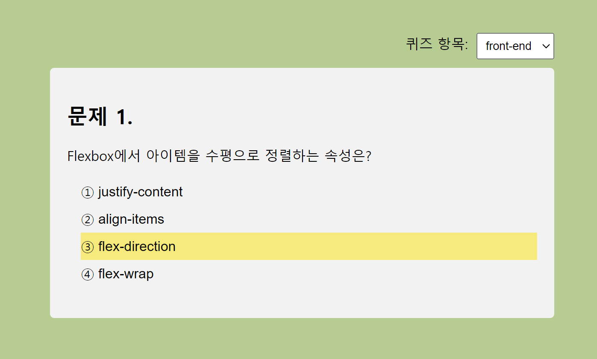
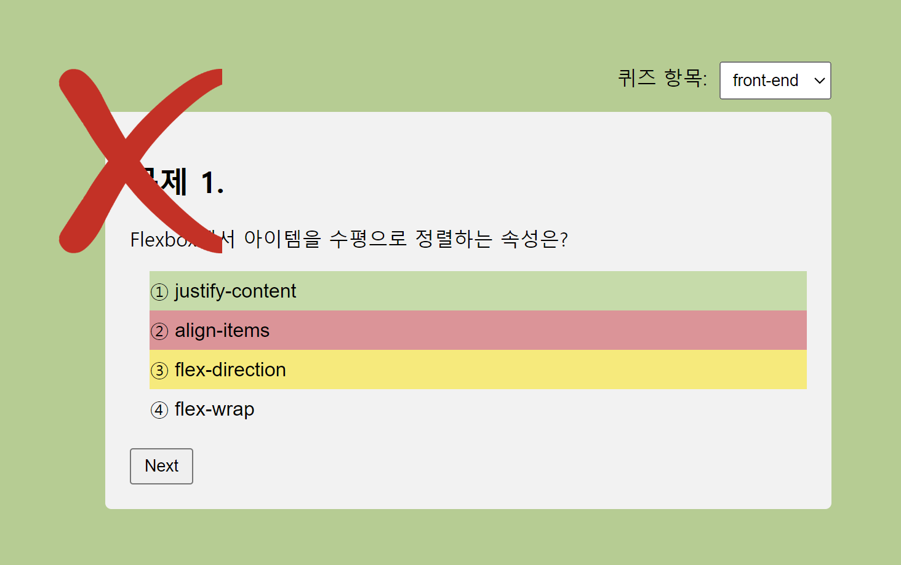

# 미션 4 퀴즈 앱

## 목표 
https://drive.google.com/file/d/1toh00h3wQHZTiTlNIPOh3YtbIBl-x3Xn/view

## 미리보기

메인


오답 선택시 


플레이

- 스펙

  - React, Vite, ts
  - Emotion

***폴더구조***
```
src
│  App.tsx
│  globalStyles.ts
│  interface.ts
│  main.tsx
│  vite-env.d.ts
│
├─assets
│      correct.png
│      incorrect.png
│      react.svg
│
├─component
│  │  NextButton.tsx
│  │  QuestionContainer.tsx
│  │  QuestionHeader.tsx
│  │  Quiz.tsx
│  │
│  ├─QuestionHeader
│  │      QuestionNumber.tsx
│  │      QuizTitle.tsx
│  │
│  ├─Quiz
│  │      QuizOption.tsx
│  │      QuizOptionContainer.tsx
│  │
│  └─shared
│          Badge.tsx
│          Flex.tsx
│          Loading.tsx
│          Select.tsx
│          TextLabel.tsx
│
├─constant
│      optionColor.ts
│
├─data
│      data.ts
│
└─fonts
        NanumMyeongjo.woff
```

## 상세


JS 3미션 퀴즈 앱을 리액트로 마이그래이션했다. 견본 영상의 제목이 'Next로 만드는 퀴즈앱'이어서 next로 만들어야하나 고민을 했지만 next의 이점인, ssr이나, SEO, 이미지최적화 등 여러요소들이 굳이 필요하지 않다고 생각해서 react로 진행했다. 대부분 이전에 만든 프로젝트에서 갖고온 공통 컴포넌트와 로직을 재활용한 파트여서 그다지 어려운 점은 없었다.

### 구현 내용
JS 미션에서 퀴즈 카테고리를 고룰 수 있는 Select Box를 우측 상단에 배치했다. 이 select요소에서 옵션을 받고 퀴즈를 고룰 수 있다. 퀴즈를 고룰 시 카테고리에 맞는 퀴즈가 1번부터 다시 차례로 진행된다. 

