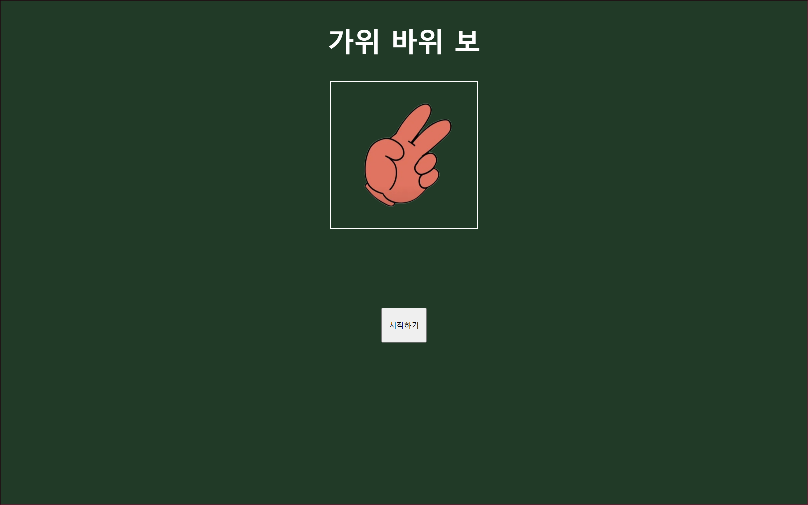
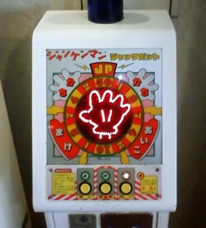

# 미션 2 가위 바위 보 앱

## 목표 
https://drive.google.com/file/d/133vW3wIghPpCeoWksTiFXCbgkdraF0pV/view

## 미리보기

메인


플레이


시간 내에 선택하지 않았을 때

### 구현 내용
- 시작하기를 누르면 게임화면으로 넘어간다.

    1. 시작 버튼을 누르면 시작 버튼을 숨기고 가위바위보 선택창을 동적으로 그린다.
  <br/>
- 컴퓨터는 가위 바위 보 중 랜덤으로 낸다.
    1. [가위, 바위, 보] 배열을 만든다.
    
    2. Math.random으로 배열의 인덱스를 무작위로 고르도록한다. 
  <br/>

- 가위 바위 보 중 뭐든 냈을 경우에 승패에 따라 스코어를 갱신하고 결과를 보여준다.
    1. 가위바위보 규칙을 따라 조건문을 분기하고 결과에 처리한다.
  <br/>

- 한 세트가 끝나면 종합 스코어를 표시하고, 다시하기 버튼으로 다시할 수 있도록 한다.
    1. 스코어창에서 데이터를 가져온다.

    2. 가져온 데이터를 통해 승패를 판별하고 함께 보여준다.

    3. 게임 한 세트를 startGame 함수로 관리할 수 있도록 했다. 다시하기 버튼을 누르면 스코어를 초기화하고 결과 모달을 숨긴 뒤 게임을 시작한다.

---
추가 구현 사항
- 컴퓨터 픽창이 슬롯처럼 계속 바뀌고, 플레이어가 낼 것을 선택했을 때 멈춘다.
    - 목표 영상을 보자마자 짱껜뽀가 떠올랐다. 이거 비숫하게 만들면 재밌지 않을까 생각해서 비숫한 느낌을 주려 추가한 기능이다. 



    1. setInterval을 통해 상대 픽창의 이미지를 계속 바꿔준다.

    2. 유저가 선택을 했을 때 interval을 clear하고, 상단에 구현한 무작위 함수를 통해 뽑힌 이미지로 바꾼다.
  <br/>

- 5초 내에 내지 않으면 패배한다.
    > 'time and tide and 짱껜뽀 wait for no man.'
    1. 이 역시 위와 같이 setInterval로 카운트다운을 한다.

    2. 긴장감을 주기위해 커졌다 작아지는 애니메이션을 활용했다.

    3. 카운트가 0이 되면 게임을 패배처리하고 1초 후 재시작이 된다.

## 트러블 슈팅 

- 게임 한판을 끝내고 결과를 확인시키는 차원으로 1초 후 게임이 다시 시작하도록 했다. 그러나 1초가 지나기 전 다음 선택을 한 경우 카운트다운의 interval이 중복으로 돌기 시작하는 문제가 있었따.
    - setInterval을 호출하기 전 먼저 선언된 interval이 있는 경우에 clearInterval을 먼저 해주는 것으로 해결할 수 있었다.
  <br/>

```diff
- 이번 미션에서 가장 헤맨 부분
``` 
리액트 개발처럼 기능별로 함수를 모듈화해서 코드를 나누는 것이 초기 목표였다. 그러나 코드를 나누면 각자의 스코프가 생기고, 그걸 중앙에서 관리하는 것이 생각보다 쉽지 않았다. 처음 countDown과 상대 픽을 스핀하는 함수를 분리하여 작업을 진행했다. 이 경우 중앙에서 이 함수들의 interval을 제어할 방법이 떠오르지 않았다. 그래서 클래스로 메소드들을 만들어두고 중앙에서 그 인스턴스를 만들어 관리했다.

## 회고

### 느낀점

처음부터 완벽한 구조를 설계하고 시작을 하려하니 시작이 되지 않았다. 큰 틀만 먼저 잡아두고 시작하는 것이 좋은 것 같다. 또, 해결되지 않는 부분을 처음부터 생각하다보면 어느새 뭘 하려고 했었는지 까먹게 되는 것 같다. 쉽게 해결 되지 않는 부분을 만났을 때 구현해야하는 부분을 명확히 파악하고 서술한 뒤 TDD 느낌으로 해결해 나가는 것이 좋은 것 같다. 이번 과제를 해결할 때 아래와같이 순서도 겸 구현 체크리스트를 만들어 진행했는데 꽤 도움이 되었다.

순서도
1. start를 누르면 
    1. 선택창이 열린다.
    2. 스코어가 표시됨.
    3. 카운트다운이 시작됨.
    4. 상대 픽이 회전함.
       
2. 선택창에서 뭔가 고른 경우
    1. 상대픽 고정.
    2. 카운트다운 멈춤. + 애니메이션도 멈춰야함
    3. 스코어 갱신 및 결과가 아래에 나옴
    4. 1초후 게임이 재시작
       1.카운트다운 시작
       2.상대픽 회전
       3. 에러 발생

3. 10판이 끝난 후 
    1. 결과를 보여줄 팝업창이 열림
    2. 재시작 버튼을 누르면 start와 똑같이 표시

### 배운 점

1. 카운트다운을 애니메이션으로 구현할 때 iteration-count는 내부 요소가 바뀌어도 계승이 된다. 
이번 프로젝트 내 예시를 들자면, 5 4 3 2 1로 가는 카운트가 3에서 멈추고 다시 5에서 시작할 때 iteration-count = 5이면  5 4 3 5 4까지 애니메이션이 적용되고, 그 후로는 적용되지 않는다. 그래서 class 자체를 떼고 다시 붙여야한다.

2. class 내부에서 항상 생성자의 this.xxx를 써야하나 싶었는데 초기값만 두고 메소드 내부에서 값만 갖고 오는 것도 꽤 좋은 방안인 것 같다.
```js
class countDown {
    constructor() {
        this.count = 5
    }

    start() {
        let count = this.count
        setInterval(()=>{
            count--
            }, 1000)
    }
}
```
대충 이런 얘기

### 더 해보기

이하 미션 시간이 모자라서 못해본 아니디어들
- 결과 창에 승수 별 확룰률을 표시한다.
    - 만약 5전 5패면 1/3^5 "와우 로또는 절대 사지마세요" 이런 느낌
- 2연패한 경우 강.력.한. 패가 등장한다.
    - 바키에 나온 가위바위보가 생각나서 만든 아이디어. 지는 패를 뽑았어도 이기는 강력한 패가 등장하면 져도 은근 기대가 되지 않을까?

### 마무리

클래스...여기저기서 배우면서 개념은 참 잘 안다고 생각했는데, 직접 써보니 걸음마수준인 것 같다... 미션 진행하면서 많이 써볼 수 있도록 노력해야겠다. 나머지 미션도 화이팅하자.

+시간상 리팩토링을 못해서 코드들이 중구난방이다...나중에 보고 비웃도록 하자
