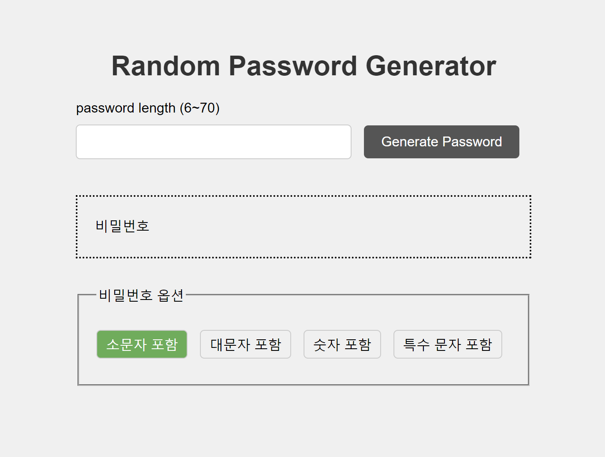
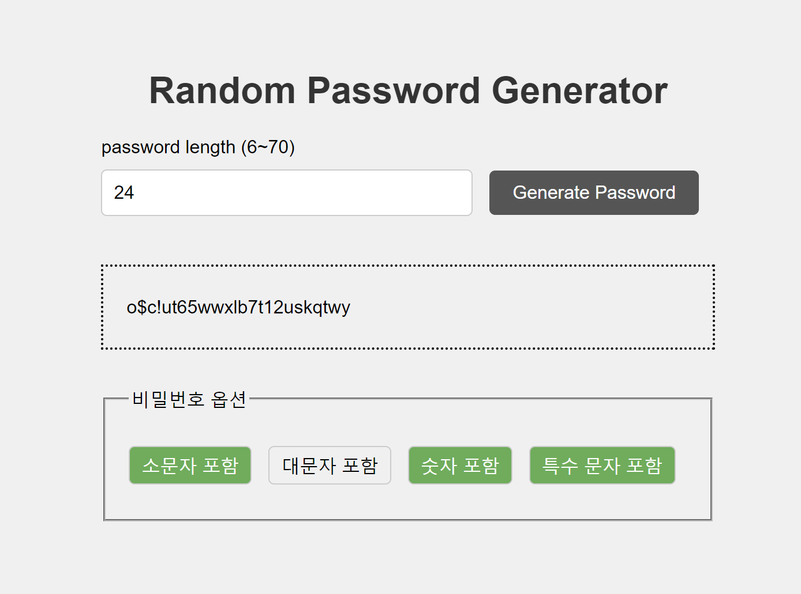
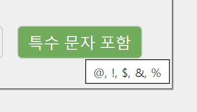

# 미션 6 비밀번호 생성 앱

## 목표

https://drive.google.com/file/d/1EGBDtOMgx_6PCWRH2wBFKkgDxqu1pq58/view

## 미리보기


초기화면


생성결과창



abbr테그 사용


시연

## 앱 로직

1.  선택된 옵션 항목에 따라 문자풀을 생성한다.

    - option checkbox input의 checked값으로 포함 시킬 문자의 배열을 만든다.

    ```js
    let pool = [];

    //영문 대문자를 풀에 추가
    if (qs("#include-uppercase").checked) {
    const uppers = Array.from({ length: 26 }, (_, idx) =>
      String.fromCharCode(idx + 65)
    );
    pool = pool.concat(uppers);

    ...
    }
    ```

2.  생성할 비밀번호 길이와 문자풀을 통해 랜덤 비밀번호를 생생한다.

    - 한 글자씩 랜덤으로 뽑아서 이어붙임

    ```js
    function pwGenerator(length, pool) {
      let result = "";
      for (let i = 0; i < length; i++) {
        let picked = pool[Math.floor(Math.random() * pool.length)];
        result += picked;
      }
      return result;
    }
    ```


3. 생성된 비밀번호를 결과창에 표시한다.
    ```js
    qs("#pw-result").textContent = password;
    ```

## 회고
난이도가 제일 쉽고 코드도 가장 짧은 프로젝트였다... 영문 대소문자를 베이스로 하고, 특수문자는 홈페이지마다 비밀번호 양식이 다르니 유저에게 입력 받는 방식으로 만드는 게 더 좋지 않았을까 싶다. 

### 더 해보기
- 현재 옵션을 선택해도 재수가 없는 경우 선택한 옵션 값이 반영이 안 될 가능성이 있다. 선택된 옵션을 반영하여 전체 집합을 만들고, 그 속에서 값을 임의로 추출하는 방식 때문이다. 더 좋은 방식으로 개발하려면 옵션으로 선택한 값들을 포함 시킬 자리를 먼저 결정한 뒤 나머지를 채우는 방식으로 로직이 구현 되면, 최소 한 개 이상의 옵션값을 포함하면서도 랜덤한 값을 얻어낼 수 있을 것이다. 다만, 너무 수학적인 얘기임으로 구현은 하지 않기로한다.